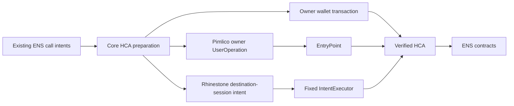

# HCA integration: research and implementation plan

Status: P0–P5 implementation complete, including Rhinestone destination sessions and Pimlico owner UserOperations. Same-chain registration is implemented; independent source funding and later APIs remain proposals.
Hosted Pimlico acceptance and Rhinestone relayer verification remain release follow-ups.
Last reviewed: 2026-09-09. Scope: the recorded ENSv2 Sepolia deployment, followed by separately
verified provider integrations. No Mainnet support is implied.

This document replaces the earlier separate-HCA-client proposal. Start here, then read:

- [Core action API and contract coverage](hca/core-actions.md)
- [Execution adapter interfaces and provider integration](hca/execution-adapters.md)
- [Existing action conventions](action-api-convention.md)
- [Future deployment upgrade playbook](future-sepolia-deployment-upgrade.md)

The phased implementation checklist is at the end of this document.

## 1. Decisions

1. Keep one `Ensforge` instance. Add `sdk.hca`; do not introduce `HcaClient`, `createHcaClient`,
   a second wallet connection, or a separate ENS configuration.
2. Core owns HCA contract actions and execution contracts. SDK binds those actions using the
   existing Promise/Effect convention. Ordinary ENS actions remain usable independently.
3. Create the optional `@ensforge/hca` package with named provider exports:
   `@ensforge/hca/rhinestone` first, followed by `@ensforge/hca/pimlico`.
4. Use each provider's supported packages. Do not publish a generic `erc4337` provider export.
   Extract shared execution internals only when implemented providers demonstrably reuse them.
5. Define a structural `ExecutionAdapter` interface. No abstract base class or compulsory inheritance.
   Account encoding and execution delivery are separate responsibilities.
6. Expose provider-specific session, sponsorship, cross-chain, and recovery features through typed
   extension properties. Unsupported features are absent, not methods that throw by default.
7. Treat deployed artifacts as authoritative. A newer source branch is not a deployment upgrade.
8. Keep HCA documented as experimental. All account/provider/chain combinations require explicit
   verification before being advertised as supported.
9. Do not duplicate `setText`, `registerName`, or other ENS actions under HCA-specific names.
   Compose their semantic call intents under an explicit HCA execution context.
10. Do not add new test files or test frameworks as part of this research. The roadmap uses existing
    checks and explicit verification runs, consistent with the current request to avoid new tests.

## 2. Evidence and provenance

### 2.1 Deployment versus source

| Item                                | Verified baseline                                                                                              |
| ----------------------------------- | -------------------------------------------------------------------------------------------------------------- |
| Artifact branch                     | `post-audit-2`                                                                                                 |
| Artifact snapshot commit            | `d0c902eeb388c7fbde3f95d9eaf6076eeedff1d7`                                                                     |
| Matching Docker/source revision     | `09bf3ac64a6fb1b215573c019b17e8c501bb3ca0`                                                                     |
| Local image                         | `ghcr.io/envoy1084/ensforge-devnet@sha256:63415642daad6f3486d305b5660a0b9c659203fc20194bafb50b6b1e1bedeef3`    |
| CI image                            | `ghcr.io/thenamespace/ensforge-devnet@sha256:0a62a0ee9225c2ed457daca15a9f6fff4db7b8094ed19ca3ad611f35291d2015` |
| Local support currently implemented | Contracts profiles/ABIs, core HCA owner actions and `sdk.hca`; no provider package                             |

The repository investigation compared all 790 source entries across the five saved Sepolia compiler
inputs with the clean `09bf3ac6` checkout: every entry matched, including dependencies. This is source
correspondence, not proof that an arbitrary rebuilt container is byte-for-byte identical.
The 32 complete V2 ABIs (including five complete HCA ABIs), 80 function fragments, and 35 configured
Sepolia addresses were also checked against the artifact snapshot. These checks do not establish
current live proxy/governance state or provider compatibility.

The artifact snapshot still uses:

```solidity
UserRegistry.initialize(address rootAccount, uint256 roleBitmap)
PermissionedResolver.initialize(address admin, uint256 roleBitmap, bytes[] setters)
```

It also still records `DNSV1MirrorRootBatchRegistrar`. The branch-tip `Grant[]` initializer and DNS
architecture changes do not belong in this deployment profile. Compiling the branch tip previously
produced a devnet whose discovery and fixture initialization failed against the deployed ABI model.
Do not change SDK ABIs to make that different devnet pass.

### 2.2 HCA addresses from the artifact snapshot

| Artifact                         | Address                                      |
| -------------------------------- | -------------------------------------------- |
| `HCAOwnerAndSessionValidator`    | `0x5f249FCa8bB4949105651146858c347E8BFb0F7E` |
| `StandaloneHCAImplementation`    | `0xAA761541620fC1a42bb701a26a9f107A9DF1E904` |
| `StandaloneHCAFactory`           | `0x900FF7cF617Ef9D802178B4ef480491e3A782672` |
| `HCAUpgradeGate`                 | `0x3A121Fc283E53d2F45564edf97dC8685Ede35005` |
| `TrustedHCASet`                  | `0xb3240a0E6c80984C14def037f4F540eDc3502B48` |
| `PermissionedResolverImpl`       | `0x9EAe5C2730a7dD16BDD1DeE6421a1B91e3B0365e` |
| `VerifiableFactory`              | `0x10dC6333CDFe1FCEf624c6e0a8221b91804Cd7ef` |
| `DefaultReverseRegistrarAdapter` | `0x7a84e241f862D73960D73c26d68c3C8F89F0B18F` |

Use `packages/contracts/src/deployments/sepolia-v2.ts` at runtime; never paste this table into
provider implementation code. Old source-tree address tables and live-proof examples contain
other deployment generations. Matching source code does not make those addresses interchangeable.
P0 verification found that `TrustedHCASet` is historical artifact metadata, not a dependency of this
account generation's active authorization path. The matched local deploy scripts do not deploy it;
reverse adapters use `StandaloneHCAFactory.authorizedOwnerOf`. Preserve the recorded address without
requiring a fictitious local trusted set or using membership as proof of HCA validity.

A source-chain funding validator is not included in the destination HCA profile and needs its own
verified manifest.

### 2.3 Primary sources and confidence

- [Sepolia address list at the artifact snapshot](https://github.com/ensdomains/contracts-v2/blob/d0c902eeb388c7fbde3f95d9eaf6076eeedff1d7/contracts/docs/addresses/sepolia.md)
- [Deployment JSON and compiler inputs](https://github.com/ensdomains/contracts-v2/tree/d0c902eeb388c7fbde3f95d9eaf6076eeedff1d7/contracts/deployments/sepolia)
- [ENS HCA guide at the matching source revision](https://github.com/ensdomains/contracts-v2/blob/09bf3ac64a6fb1b215573c019b17e8c501bb3ca0/docs/HCA.md)
- [HCA account source](https://github.com/ensdomains/contracts-v2/blob/09bf3ac64a6fb1b215573c019b17e8c501bb3ca0/contracts/src/hca/StandaloneSingleOwnerHCA.sol)
- [Owner/session validator](https://github.com/ensdomains/contracts-v2/blob/09bf3ac64a6fb1b215573c019b17e8c501bb3ca0/contracts/src/hca/HCAOwnerAndSessionValidator.sol)
- [Factory](https://github.com/ensdomains/contracts-v2/blob/09bf3ac64a6fb1b215573c019b17e8c501bb3ca0/contracts/src/hca/StandaloneHCAFactory.sol)
- [Funding validator](https://github.com/ensdomains/contracts-v2/blob/09bf3ac64a6fb1b215573c019b17e8c501bb3ca0/contracts/src/hca/HCAFundingSessionValidator.sol)

Contract behavior below comes from the exported artifacts and their matched source. ENS guide route
examples are upstream evidence, not Ensforge integration results. Provider documentation establishes
provider features, not compatibility with this particular HCA. Proposed interfaces and phase order
are Ensforge design decisions.

## 3. What HCA does

An HCA is an optional owner-bound ENS execution account based on Nexus. The wallet remains the name
owner. The HCA can retain resolver permissions for later session operations. It is not a general
wallet: it rejects delegatecall and standard NFT receiver callbacks, and its owner cannot be changed.
It can temporarily hold native/token funds, which the owner can recover through explicit execution.

There are three different routes:

| Route               | Caller/authorization                      | Infrastructure                                     | Current confidence                                                                  |
| ------------------- | ----------------------------------------- | -------------------------------------------------- | ----------------------------------------------------------------------------------- |
| Owner transaction   | Wallet calls `executeByOwner`             | RPC + owner wallet                                 | Implemented in P1; local owner execution and rejection paths verified               |
| Owner UserOperation | EntryPoint and fixed owner validator      | Compatible bundler; optional paymaster             | Contract supports it; Pimlico proof pending                                         |
| ENS session intent  | Fixed IntentExecutor and scoped validator | Compatible Rhinestone SDK and route infrastructure | Patched SDK signatures verified with local deployment; hosted relayer proof pending |

A bundler submits UserOperations. A paymaster may fund gas. Neither changes the account's validator.
The deployed `validateUserOp` path validates owner signatures; existing ENS session execution uses
the intent/ERC-1271 path. A Pimlico adapter must not claim that it unlocks those sessions.



### Session limits

Permitted session operations include commitments, registration to the HCA owner, approved resolver
creation, supported record setters, the HCA-aware primary-name operation, required owner resolver
role grants, and tightly constrained payment approvals/refunds. The session binds resolver, key,
expiry, account nonce, and optional refund limits. It can cover multiple names; it is not inherently
a single-label authorization.

Sessions do not permit renewal, name transfer, subname creation, resolver replacement, arbitrary
calls/transfers, unrelated authority grants, registry-wide approvals, upgrades, or module management.
HCA owner execution may support operations outside this list when the HCA has the necessary ENS
permissions. Do not automatically grant those permissions to make a call succeed.

`revokeSessions` increments the HCA session nonce and invalidates all destination sessions. It must
be called directly by the owner. This does not uninstall a source funding validator or clear token
allowances. Those are separate authorizations and recovery actions.

## 4. Package and SDK architecture

```text
packages/contracts   deployed ABIs, addresses, fragments, versions
       ↑
packages/core        HCA actions, verified account/plan types, execution contracts
       ↑                    ↑
packages/sdk         packages/hca
existing Ensforge    provider implementations and workflow functions
       ↑                    ↑
packages/react       optional UI bindings to existing config and operations
```

Core must never import `@ensforge/hca` or a provider SDK. `@ensforge/hca` must not import the SDK class;
it accepts `EnsforgeConfig`, typed plans, account descriptors, and signer dependencies. SDK can accept
an adapter structurally because the contract lives in core.

Planned exports:

```text
@ensforge/core/hca             HCA actions, schemas and types
@ensforge/core/hca/admin       explicit governance operations
@ensforge/core/execution       provider-neutral execution contracts/helpers
@ensforge/sdk/hca              bound action types and standalone re-exports
@ensforge/hca                  provider-free HCA account/workflow helpers
@ensforge/hca/pimlico          named Pimlico adapter and types
@ensforge/hca/rhinestone       named Rhinestone adapter and extensions
```

The main SDK gains `readonly hca: HcaActions`, using existing `make…Actions` and `bindAction`.
Experimental status is documented; do not ship two parallel stable/experimental action paths.
Providers are loaded only from their subpaths. Use optional peer dependencies for provider SDKs and
exact development versions for verification; importing one provider must not require the others.
Determine compatible version ranges during provider spikes, not from package marketing claims.

Minimal usage, with proposed APIs:

```ts
import { Ensforge } from "@ensforge/sdk";
import { pimlico } from "@ensforge/hca/pimlico";

const sdk = new Ensforge(config);
const execution = pimlico({
  profile,
  chain,
  owner,
  client: existingPimlicoClient,
  sponsorship: { client: existingPaymasterClient },
});

const submission = await sdk.hca.executeHcaCalls({
  hca,
  execution,
  authorization: { kind: "owner" },
  calls: [
    sdk.records.setText.call({ name: "alice.eth", key: "url", value: "https://alice.example" }),
  ],
});

const result = await sdk.hca.waitForHcaExecution({ submission, execution });
```

Provider constructors are synchronous configuration factories, not another ENS client. Provider
methods themselves use the repository's Effect-canonical, Promise-facade convention. Adapter
configuration holds transport/provider dependencies; it must not duplicate the selected ENS network.

## 5. Account profiles and preparation

Enrich HCA metadata with account version, on-chain account ID, canonical initial salt, factory,
initial/current implementation distinction, validator, executor, EntryPoint, proxy logic, gate
addresses, reverse adapter, and payment policy. Constants readable from deployed contracts should be
resolved and verified, not copied into anonymous configuration objects.

The matched ENS guide specifies SDK account version `ens-standalone-1.1.0`, on-chain ID
`ens-standalone-hca.1.1.0`, and user salt `0`. Verify these against the selected deployment at adoption.
A version string and an on-chain account ID are different identifiers.

Factory deployment derives the salt from owner, initial implementation, and user salt, then uses the
Verifiable Factory proxy derivation. Preserve all inputs after an in-place upgrade. A changed initial
implementation or salt describes another account, not an upgrade to the same address.

Before executing, verify code, expected owner, account ID, factory-certified owner, recognized current
implementation, and supported execution path. An undeployed address must carry prediction inputs;
never fabricate a verified owner from an empty address. A race where someone deploys the expected
account first requires re-verification, not unconditional retry or account switching.

Resolve semantic ENS intents under an HCA execution context without mutating `config`:

- inner `msg.sender`: HCA;
- authorizing owner: connected owner or explicitly supplied owner signer;
- registrar recipient: owner wallet for the fixed session;
- provider delivery: separate from ENS target/permission resolution.

Simulate the complete outer account operation where possible. Individual inner-call simulations do
not establish atomic behavior when earlier calls deploy a resolver or grant permissions needed later.
New HCA workflows must not weaken the existing simulation requirement for ordinary ENS writes.
If counterfactual simulation needs provider infrastructure, fail unsupported until that path is proved.

## 6. Registration and ongoing use

### Direct owner route

Predict/verify account → deploy/fund if necessary → commit transaction → commitment confirmation →
wait minimum age → refresh price → reveal batch → final receipt. Every transaction is explicit.
An owner transaction needs no additional HCA message signature. Direct ENS wallet calls remain
available when HCA execution is unnecessary.

### Rhinestone same-chain route

Prepare resolver/account/session → show authorization and funding limits → obtain session authorization
and required token permit → prepare first route → deploy if needed, fund, enable session, commit →
wait → refresh registration price and quote → reveal using the session. Signature counts depend on
existing account/funding state and the verified route; do not promise a universal one-signature UX.

The deployed reveal batch is ordered:

1. Deploy the approved resolver when missing using `initialize(HCA, ROLES.ALL, [])`.
2. Approve the selected payment token to the registrar for the current registration price.
3. Register using the original commitment inputs and the wallet as recipient.
4. Apply selected resolver records.
5. Optionally call the HCA-aware reverse adapter for the wallet's primary name.
6. Grant the wallet root resolver roles with `authorizeNameRoles(0x00, ROLES.ALL, wallet, true)`.

Inner values are zero for the documented token-paid session route. Distinguish resolver `setName`
from reverse-adapter `setNameWithHCA`; they have different effects. Keep HCA resolver roles for later
session operations unless the user explicitly removes that authority.

### Independent Rhinestone cross-chain funding

Cross-chain funding belongs to the concrete Rhinestone adapter, not to registration. The proposed
`execution.crossChain` API exposes `quoteFunding`, `fund`, `getFundingStatus`, and `waitForFunding`.
Additional recovery or cancellation methods are exposed only when supported by the verified route.
These methods return funding-specific identifiers and outcomes, separate from ENS execution.

The application first quotes and funds the destination HCA, waits for confirmed destination funds,
and then starts or resumes normal same-chain registration. It may use Rhinestone to fund and Pimlico
to execute. Registration knows only its destination balances and spending limits: it neither bridges
nor stores source-chain routes. Commit and reveal still receive fresh destination execution quotes;
any additional funding is an explicit application decision.

Configure a source account with verified funding-validator deployments. Funding authorization binds
the allowed source, token, destination HCA, expiry, and spending limits. Do not imply a generic bridge:
standalone funding support, permits, settlement behavior, and tokens must be verified with Rhinestone.

Track source claims and destination funding independently. A source transaction may succeed while
funding is delayed; do not resubmit or assume a refund. Local cancellation never reverses a source
transaction. Funding has its own persistence/recovery records; P5 registration storage is separate.
No chain is enabled from its name alone, and guide proof addresses are not deployment defaults.

### State, persistence and recovery

The implemented actions remain on the existing SDK:

```ts
const operation = await sdk.hca.startHcaRegistration({ execution, storage, ...parameters });
const resumed = await sdk.hca.resumeHcaRegistration({ execution, storage, id: operation.id });
```

The storage contract supports atomic `create`, `get`, and revision-checked `compareAndSwap`.
Core owns the contract so dependencies remain inward; `@ensforge/hca` re-exports it and provides a
versioned JSON codec and in-memory development implementation. Production storage is caller-supplied.
See the [registration implementation](../packages/core/src/actions/hca/start-hca-registration/index.ts).

Progress is explicit: `created`, `submitting`, `submitted`, `waiting`, `needs-review`, `needs-funding`,
`needs-authorization`, `registered`, `failed`, `expired`, or `cancelled`. Immutable registration inputs
and the random commitment secret are saved before commit. **The full codec contains that secret**;
protect storage until reveal and never treat it as a public telemetry/export record. Signer references
are saved, but private keys, provider credentials, and signed provider operations are not.

The durable submission claim prevents concurrent broadcasts. An uncertain attempt is never released
on a timer. A recovered submission can be supplied explicitly and is checked against the stored
account, step, route, and plan fingerprint. Provider data is persisted through its whitelist codec.

Resume refreshes price, execution quote, funding, and authorization before an eligible step. The HCA
and permissioned resolver must already be deployed; sessions must already be enabled. An atomic
reveal includes exact payment approval, registration, owner root-role grant, and optional primary-name
setup. Local cancellation preserves reusable sessions and does not reverse on-chain activity.

Closing the browser stops orchestration; submitted intents do not schedule the later reveal. The
application calls resume after the waiting period. Source funding and remote automation are separate.

## 7. Validation and unresolved decisions

Required evidence before release:

- Artifact/source correspondence, runtime code/immutables and proxy wiring are separate checks.
- Local Docker deployment addresses are discovered; Sepolia addresses are not used on chain 31337.
- Local contract execution does not prove live bundler or paymaster acceptance.
- The upstream mockestrator does not prove production signatures, funding, or settlement.
- CI authenticates the private `thenamespace` package; local uses the public `envoy1084` digest.
- New image pins were checked/pulled as documented in test-env; this document does not claim a
  completed HCA integration suite or successful private-image local pull.
- Existing tests, lint, types, builds and package-consumer checks run as relevant to implementation.
  Provider proofs use bounded, explicitly authorized testnet operations; do not send transactions
  merely to validate this research document. No analytics events should be emitted by verification.

Resolve during the named phase rather than inventing answers:

| Question                                                                | Owner phase / required decision                                         |
| ----------------------------------------------------------------------- | ----------------------------------------------------------------------- |
| Does released Rhinestone support this standalone account patch?         | P3: patched 1.8.0 locally proven; hosted Sepolia smoke test remains     |
| Which Pimlico version supports our EntryPoint and estimation signature? | P4: provider proof with the HCA, not their default account              |
| Which source-chain funding artifacts match our destination generation?  | P6: independent manifest and claim/fill proof                           |
| How do adapter results preserve existing `executeWritePlan` semantics?  | P1: new HCA submission types; do not change ordinary action results     |
| How do serialized submissions retain provider typing?                   | P2: versioned codecs and validation on restore                          |
| Which inherited Nexus management functions should be public?            | P7: prove authorization and usefulness before adding high-level actions |
| Browser versus remote session custody?                                  | P5/P8: caller-supplied signer/store; no automatic secret upload         |

## 8. Phased TODOs

### P0 — freeze the deployment boundary

- [x] Record the artifact snapshot and matched source revision in an HCA capability profile.
- [x] Add missing focused ABI fragments only from the deployed artifacts.
- [x] Verify factory approval, owner validator, executor, EntryPoint, proxy logic and reverse wiring.
- [x] Preserve existing single-owner initializer shapes and DNS deployment metadata.
- [x] Record source-chain funding manifests separately; leave unverified routes disabled.
- [x] Seed HCA fixtures through local discovery without hard-coded Sepolia addresses.

Implemented: `@ensforge/contracts/deployments` exports the pinned profile and rejects unsupported
public chains. Focused ABIs are in `v2/fragments/`. `test-env` discovers local HCA dependencies,
verifies wiring and seeds a factory-certified salt-zero owner account. Source funding is a separate,
empty manifest list and remains disabled.

Verification: exact ABI-fragment comparison with the pinned artifacts, read-only Sepolia wiring,
and the existing devnet seed/checkpoint/reset verification passed. Default-validator verification
uses compiler-recorded immutable positions guarded by an executable-template hash; Nexus's installed
module list excludes this validator. The local image's executable template matches Sepolia after
zeroing immutable words; the Solidity metadata hash differs. Provider compatibility is still unproven.

Repeat: `pnpm --filter @ensforge/test-env verify` and `pnpm verify:hca:sepolia`.

Exit achieved: one reproducible HCA account generation, with unsupported public networks rejected explicitly.

### P1 — core actions and existing SDK group

- [x] Implement prediction, focused reads, verification, capabilities and account descriptor schemas.
- [x] Add `sdk.hca` using existing binders; expose `.effect`, `.request`, and safe `.call` descriptors.
- [x] Add owner deployment and atomic execution, plus direct owner session revocation.
- [x] Implement HCA caller context for existing ENS call intents without mutating global config.
- [x] Handle deployment races, wrong-owner accounts, and unsupported implementation/version errors.
- [x] Verify representative owner batches and failure rollback against the matching devnet.

Implemented: all 16 P1 actions, existing SDK binding conventions, automatic Sepolia profile selection,
explicit local profile configuration, direct atomic owner calls, adapter dispatch without fallback,
submission tracking and owner-only revocation. See the [shipped P1 API](../packages/core/src/actions/hca/index.ts).

Direct execution always simulates the complete batch. Adapter execution requires a successful full
simulation from its preparation step and consistent account/plan/adapter identities. P3 adds validated destination-session preparation. The current adapter envelope is the P1 owner-delivery boundary; P2 now adds provider typing, persistence, expiry/fee policies and extensions. ENS semantic preparers currently
retain their existing configured-wallet requirement; raw adapter calls do not need a wallet.

Verified locally: prediction, existing/new deployment, owner/factory checks, delegated ENS intents,
pre-broadcast rejection of a reverting batch, nonce revocation, read requests, adapter lifecycle,
tracking and instance mismatch rejection. A local adapter harness proves dispatch, not provider
compatibility. `test-env verify` now exercises owner execution/revocation and checkpoint restoration.

Exit achieved: useful HCA interaction with an ordinary wallet, no provider dependency and no new client.

### P2 — optional package and execution contracts

- [x] Scaffold `@ensforge/hca` and named provider subpaths with the repository's existing tooling.
- [x] Implement the typed five-method adapter contract and shared wait/watch orchestration.
- [x] Define prepared-plan fingerprints, authorization summaries, codecs and submission reconciliation.
- [x] Add optional typed capability extensions; reject unsupported features before signing.
- [x] Verify base/core imports do not load provider SDKs or require unrelated peers.
- [x] Prove adapter mismatches and restored invalid envelopes fail without side effects.

Implemented in [`@ensforge/hca`](../packages/hca/src/index.ts): typed lifecycle wrappers, immutable
review envelopes, account/nonce revalidation, bounded wait/watch, explicit fee limits, expiry checks,
versioned tracking codecs and optional typed extensions. P3 implements Rhinestone; P4 adds the named Pimlico adapter with optional ETH sponsorship and counterfactual deployment. Existing semantic preparers retain their wallet-context requirement.

Exit: the same SDK operation accepts an external adapter while preserving concrete submission types.
Local owner-delivery proofs cover restore rejection, expiry, budgets, duplicate submission, changed
nonce, uncertain outcomes and interruption. No provider SDK compatibility is claimed by this proof.

### P3 — Rhinestone destination sessions

- [x] Inspect stock SDK releases against ENS's pinned 1.8.0 patch.
- [x] Pin SDK 1.8.0 with the reproducible ENS patch and documented executor-address extension.
- [x] Implement `rhinestone()` through the P2 lifecycle with a typed `sessions` extension.
- [x] Derive the exact HCA configuration and verify existing accounts and resolver provenance.
- [x] Use SDK permission IDs and execution signatures; enable destination sessions through core owner calls.
- [x] Add core `enableHcaSession`, `enableHcaSessionWithRefund`, and `isHcaSessionEnabled` actions.
- [x] Extend core preparation/execution with confirmed session references and full fixed-policy checks.
- [x] Reconcile canonical enablement events, replacement, expiry, enabled status and session nonce.
- [x] Prove allowed record updates, prohibited calls, wrong resolver, expired/revoked/replaced sessions, and SDK refund signatures locally.
- [x] Add bounded refund configuration and separate registration price from execution fees.

The [provider entry point](../packages/hca/src/providers/rhinestone.ts) define the P3 boundary:
an already deployed, prefunded HCA, one same-chain no-funding intent, no swaps or source calls.
The SDK must return identical destination calls and a single execution nonce. Signed operations
stay in memory; only public submission tracking is restorable.

Inspection corrected the original enablement plan: generic SDK session-detail/owner-proof helpers
use Smart Session Emissary. This destination-only flow instead enables the fixed ENS validator
through the existing owner route, then uses the SDK to sign enabled-session execution. Atomic
first-use owner proofs and source authorization are deferred to workflow/funding phases.

Local proofs cover SDK derivation/signatures, resolver deployment and records, exact owner role grants,
commit/reveal, separate fee review, denied calls, wrong resolver, expired/revoked/replaced sessions,
and bounded-refund signatures. Existing owner-adapter behavior is checked separately.

Release follow-up: verify hosted Sepolia routing, relayer settlement and real refund reimbursement
with provider credentials. Local mock-relayer proofs do not establish hosted service availability.

Exit: a destination session works with the exact artifact-backed HCA; direct owner route remains usable.

### P4 — Pimlico owner execution

- [x] Install a verified `permissionless` version and implement the named `pimlico()` adapter.
- [x] Implement HCA account encoding, owner signature/stub, nonce and counterfactual factory data.
- [x] Verify chain and EntryPoint support before preparation.
- [x] Prove funded, deployed owner UserOperation execution, then undeployed account execution.
- [x] Add optional sponsorship and provider fee estimation; verify rejection/expiry behavior.
- [x] Reconcile UserOperation success separately from the outer transaction's success.
- [x] Keep session/cross-chain extensions absent for this HCA until independently supported.

Local EntryPoint verification covers deployed and counterfactual owner execution. Hosted Pimlico
bundler validation and real sponsorship remain integration checks; local estimation uses a test
transport, not Pimlico simulation. See [the implemented API](../packages/hca/src/providers/pimlico.ts).

- [ ] Verify hosted Pimlico acceptance, factory validation policy, and real sponsorship.

Exit: a provider-backed HCA owner route works without Rhinestone installed.

### P5 — resumable same-chain registration

- [x] Implement start/get/resume/cancel-local workflow functions with caller-supplied storage.
- [x] Persist commitment inputs and protected signer references before external side effects.
- [x] Prepare atomic reveal including owner role grant and optional primary-name operation.
- [x] Refresh price and quote after the commitment delay; request more funding only if necessary.
- [x] Verify restart, duplicate resume, missing secret, stale quote, allowance and expiry cases.
- [x] Support later permitted updates with the same session without deleting reusable keys.

Local proofs cover owner/Pimlico/Rhinestone registration, primary name, revision conflicts, restart,
missing secrets, funding/review requirements, expired commitments, revoked sessions, and lost storage
responses. Hosted provider proofs remain separate release checks.

Exit: end-to-end same-chain registration can resume without losing state or double-submitting.

### P6 — independent Rhinestone cross-chain funding

- [ ] Verify standalone funding of the destination HCA through each supported source/token route.
- [ ] Verify source funding validators, account versions, tokens, and settlement infrastructure.
- [x] Expose typed `execution.crossChain.quoteFunding`, `fund`, `getFundingStatus`, and `waitForFunding`.
- [x] Implement explicit EOA/Permit2 funding authorization and exact approval calls; reject unverified source account generations.
- [x] Persist independent funding identifiers in the shared namespaced HCA store; inspect source debits and destination credits separately.
- [x] Provide identifier recovery, local pre-submission cancellation, and explicit Permit2 nonce/allowance cleanup calls.
- [x] Demonstrate the local EOA funding flow followed by ordinary registration with one shared store.
- [x] Keep registration and the common execution interface independent of funding providers.

Implemented the bounded EOA/ERC-20 Permit2 path. See [funding implementation](../packages/hca/src/rhinestone/cross-chain/index.ts)
and [storage contract](../packages/core/src/actions/hca/storage.ts). No public route manifest is enabled by default.
Local signature/receipt proofs use a mock source RPC and orchestrator; hosted settlement and source
contract proofs remain unchecked above. Status observes token movements and does not authenticate
an intent ID against the signed mandate or prove cross-chain finality.

Exit: verified funding routes can fund an HCA independently of the ENS action or execution adapter
used afterwards. Registration never automatically bridges or launches source-chain operations.

### P7 — complete account and governance surface

- [ ] Finish deposits, signature inspection, nonces and module/registry inspection reads.
- [ ] Add upgrade eligibility and direct-owner upgrade with both gate checks.
- [ ] Add explicit `hca/admin` factory/gate/trusted-set operations and existing permission reuse.
- [ ] Classify every inherited ABI function as action, inspection, internal callback or unsupported.
- [ ] Resolve self-call-only withdrawal/registry management and emergency hook behavior before exposing it.
- [ ] Keep module installation, owner transfer and unsupported session actions unavailable.

Exit: coverage is explicit without inventing unsupported contract capabilities.

### P8 — React, remote orchestration and future accounts

- [ ] Bind selected workflows to the existing React provider/config; do not add an HCA client provider.
- [ ] Add remote execution only with authenticated operations and explicit session-key custody.
- [ ] Separate browser cancellation, source cancellation and destination revocation in UI state.
- [ ] Investigate ZeroDev/Kernel, Safe or other accounts independently; do not treat them as HCAs.
- [ ] Revisit shared abstractions only after a second account implementation proves the need.

Exit: additional integrations preserve the one-SDK architecture and account compatibility checks.

### P9 — release and Mainnet gates

- [ ] Write HCA user documentation and examples in `apps/docs` during this final phase; do not add package guides.

- [ ] Run relevant existing workspace checks, package builds and consumer/import verification.
- [ ] Document exact provider package versions, deployment manifests and reproducible proof commands.
- [ ] Add changesets for implemented publishable changes, not for this research-only update.
- [ ] Keep unproved capability flags disabled; list residual limitations explicitly.
- [ ] Enable Mainnet only after authoritative artifacts, wiring checks and provider route proofs exist.

Exit: release claims are backed by deployment and provider evidence, not branch names.
